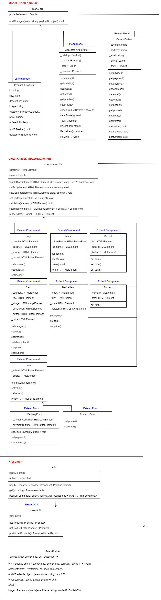

# Проектная работа "Веб-ларек"

Стек: HTML, SCSS, TS, Webpack

Структура проекта:
- src/ — исходные файлы проекта
- src/components/ — папка с JS компонентами
- src/components/base/ — папка с базовым кодом

Важные файлы:
- src/pages/index.html — HTML-файл главной страницы
- src/types/index.ts — файл с типами
- src/index.ts — точка входа приложения
- src/scss/styles.scss — корневой файл стилей
- src/utils/constants.ts — файл с константами
- src/utils/utils.ts — файл с утилитами

## Установка и запуск
Для установки и запуска проекта необходимо выполнить команды

```
npm install
npm run start
```

или

```
yarn
yarn start
```
## Сборка

```
npm run build
```

или

```
yarn build
```

## UML-схема


## Данные и типы данных, используемые в приложении

Интерфейс карточек товаров

```
export interface IProduct {
	id: string;
	title: string;
	description: string;
	image: string;
	category: 'софт-скил'| 'другое'| 'дополнительное'| 'кнопка';
	price: number | null;
	ordered: boolean;
	addToBasket: () => void;
	deleteFromBasket: () => void;
}
```

Интерфейс формы c оплатой

```
export interface IOrderDeliveryForm {
	payment: string;
	address: string;
}
```

Интерфейс формы с контактными данными

```
export interface IOrderContactsForm {
	email: string;
	phone: string;
}
```

Интерфейс формы

```
type IOrderForm = IOrderDeliveryForm & IOrderContactsForm;

export interface IOrder extends IOrderForm {
   items: IProduct[];
   validation(): void;
   clearOrder(): void;
   postOrder(): void; 
}
```

Интерфейс состояния приложения

```
export interface IAppState {
	catalog: IProduct[];
	basket: IProduct[];
	order: IOrder;
	preview: IProduct;
	checkLotBasket(): boolean;
	clearBasket(): void;
	Total(): number;
	BasketIds(): number;
	BasketLen(): number;
	initOrder(): IOrder;
}
```

## Архитектура приложения

Код приложения разделен на слои согласно парадигме MVP: 
- слой представления, отвечает за отображение данных на странице, 
- слой данных, отвечает за хранение и изменение данных
- презентер, отвечает за связь представления и данных.

### Базовый код

#### Класс Api
Содержит в себе базовую логику отправки запросов. В конструктор передается базовый адрес сервера и опциональный объект с заголовками запросов.
Методы: 
- `get` - выполняет GET запрос на переданный в параметрах ендпоинт и возвращает промис с объектом, которым ответил сервер
- `post` - принимает объект с данными, которые будут переданы в JSON в теле запроса, и отправляет эти данные на ендпоинт переданный как параметр при вызове метода. По умолчанию выполняется `POST` запрос, но метод запроса может быть переопределен заданием третьего параметра при вызове.

#### Класс EventEmitter
Брокер событий позволяет отправлять события и подписываться на события, происходящие в системе. Класс используется в презентере для обработки событий и в слоях приложения для генерации событий.  
Основные методы, реализуемые классом описаны интерфейсом `IEvents`:
- `on` - подписка на событие
- `emit` - инициализация события
- `trigger` - возвращает функцию, при вызове которой инициализируется требуемое в параметрах событие   

#### Класс Component
Базовый абстракный класс для других компонентов, для работы с DOM в дочерних компонентах.
- `toggleClass` - переключить класс
- `setText` - установить текстовое содержимое
- `setDisabled` - сменить статус блокировки
- `setHidden` - скрыть елемент
- `setVisible` - показать елеиент
- `setImage` - установить изображение с алтернативным текстом
- `render` - вернуть корневой DOM-элемент

#### Класс Model
Базовый абстракный класс для компонентов модели данных. Связывает переданные данные со свойствами объекта и инициализирует вызов именованных событий через метод emitChanges.

### Слой данных (Model) Mvp

#### Класс AppState

Класс данных отвечает за хранение и логику работы с данными корзины, продуктов и заказа.\
В полях класса хранятся следующие данные:
- basket - отслеживание выбранных карточек в корзине
- catalog - отслеживание списка доступных карточет продуктов
- order - отслеживает состояние заказа
- preview - отслеживает продукт в модальном окне

Методы:
- `checkProductBasket` - проверяет наличие продукта в корзине
- `clearBasket` - очищает корзину
- `Total` - возвращает полную стоимость продуктов в корзине
- `BasketIds` - возвращает индексы продуктов находящихся в корзине
- `BasketLen` - возвращает количество продуктов находящихся в корзине
- `initOrder` - инициализация объекта заказа
- а так-же сеттеры и геттеры для сохранения и получения данных из полей класса

#### Класс Product

Класс данных продукта. Структура определяется ответом сервера. Свойства и методы реализуют логику взаимодействия с корзиной. \
В полях класса хранятся следующие данные:
- id - идентификатор продукта
- title - заголовок
- description - описание
- image - путь до файла картинки
- category -  категория продукта
- price - цена
- ordered - признак наличия товара в заказе

Методы:
- `addToBasket` - добавить в корзину товар
- `deleteFromBasket` - удалить из корзины товар

#### Класс Order

Класс данных заказа. Содержит свойства, которые отображаются на полях соответствующих форм. Производит валидацию полей формы.
В полях класса хранятся следующие данные:
- payment - тип платежа
- address - адрес
- email - почта
- phone - телефон
- items - объекты продуктов в корзине

Методы:
- `validation` - проверка полей формы
- `clearOrder` - очистка полей формы
- `postOrder` - событие завершения оформления заказа
- а так-же сеттеры и геттеры для сохранения и получения данных из полей класса

### Классы представления (View) mVp

Все классы представления отвечают за отображение внутри контейнера (DOM-элемент) передаваемых в них данных.

#### Класс Page
Класс представления основной страницы. \
В полях класса хранятся следующие данные:
- counter - количество элементов в корзине
- gallery - список товаров для отображения
- wrapper - блокирует прокрутку страницы
- basket - кнопка для отображения корзины

#### Класс Card
Класс представления карточки. \
В полях класса хранятся следующие данные:
- category - категория
- title - заголовок
- image - путь до файла картинки
- description - описание
- button - текст кнопки добавления в заказ
- price - стоимость

#### Класс Form
Класс представления формы. \
В полях класса хранятся следующие данные:
- submit - кнопка подтверждения формы
- errors - блок отображения ошибок

#### Класс Modal
Класс представления модального окна.\
В полях класса хранятся следующие данные:
- closeButton - отображение кнопки закрытия
- content - отображение содержания модального окна

#### Класс DeliveryForm
Класс представления формы с информацией о способе оплаты и адресом доставки. \
В полях класса хранятся следующие данные:
- paymentContainer - элементы формы
- paymentButtons - элементы формы

#### Класс ContactsForm
Класс представления отображения формы оформления заказа с контактной информацией.\
Методы:
- `set phone` - задать телефон
- `set email` - задать почта

#### Класс Basket
Класс представления корзины.\
В полях класса хранятся следующие данные:
- list - список элементов в корзине
- total - стоимсоть корзины
- button - кнопка открытия формы оформления заказа

#### Класс BasketItem
Класс представления элементов корзины. \
В полях класса хранятся следующие данные:
- index - номер товара в корзине
- title - название товара в корзине
- price - стоимость товара в корзине
- deleteBtn - кнопка удаления из корзины

#### Класс Success
Класс представления информации оформленного заказа.\
В полях класса хранятся следующие данные:
- total - общая стоимость заказа


[Ссылка на проект](https://github.com/pbutsik/web-larek-frontend)

UML схема приложена ./src/images/Larek_MVP.png