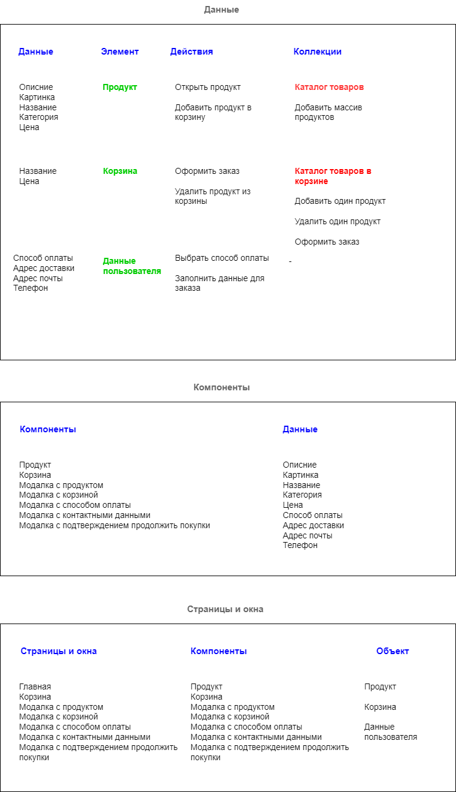

# Проектная работа "Веб-ларек"

Стек: HTML, SCSS, TS, Webpack

Структура проекта:
- src/ — исходные файлы проекта
- src/components/ — папка с JS компонентами
- src/components/base/ — папка с базовым кодом

Важные файлы:
- src/pages/index.html — HTML-файл главной страницы
- src/types/index.ts — файл с типами
- src/index.ts — точка входа приложения
- src/styles/styles.scss — корневой файл стилей
- src/utils/constants.ts — файл с константами
- src/utils/utils.ts — файл с утилитами

## Установка и запуск
Для установки и запуска проекта необходимо выполнить команды

```
npm install
npm run start
```

или

```
yarn
yarn start
```
## Сборка

```
npm run build
```

или

```
yarn build
```

## Brainstorm


## Данные и типы данных, используемые в приложении

Интерфейс карточек товаров

```
export interface ICard {
    id: string;
    description: string;
    image: string;
    title: string;
    category: string;
    price: number;
    itemIndex: number;
}
```

Интерфейс товара

```
export type IProductItem = Pick<ICard, "id" | "description" | "image" | "title" | "category" | "price">
```

Интерфейс корзины заказов

```
export interface IOrderForm {
    items: string[];
    payment: string;
    address: string;
    email: string;
    phone: string;
    total: number;
}
```

Интерфейс состояния приложения

```
export interface IAppState {
    catalog: IProductItem[];
    preview: string | null;
    order: IOrderForm | null;
}
```